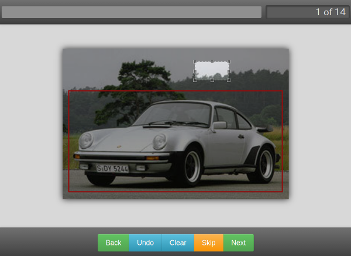

## About this repository

This repository is fork of http://github.com/shkh/TrainingAssistant.git

NeoTrainingAssistant is application tool for create annotation data of OpenCV, 
and to crop images.

## Requirements

* python3
* pip3
* git

## How to install

1. Clone repository:

		% git clone git@github.com:furaibo/NeoTrainingAssistant.git

2. Add Jcrop:

		% cd NeoTrainingAssistant
		% git submodule init
		% git submodule update
		% cd static/Jcrop
		% git checkout master

3. Install python modules via pip3

		% sudo pip3 install -r freezed.txt

## How to run

1. Add images to `NeoTrainingAssistant/static/img`

2. Run server

		% cd NeoTrainingAssistant
		% python3 views.py

This command starts the Flask server on port 5000, and please access `http://localhost:5000` with web browser.

## How to use
### Image

### About buttons
| Button   | Explanation  |
|----------|:-------------|
| Back     | back to previous image |
| Undo     | remove a latest rectangle |
| Clear    | remove all rectangles |
| Overall  | make a rectangle encloses overall of current image |
| Dismiss  | dismiss(not use) an image and go to next image |
| Skip     | add 'negative' flag to current image and go to next image |
| Next     | add 'positive' flag to current image and go to next image |

### Get data
After all images will be processed, you will get `positive.txt`, `negative.txt` and crop images in `NeoTrainingAssistant/static/img_dst/[%DATETIME%]`. Dismissed images won't be described in these text-files.

### Settings
You can change settings with edit of `NeoTrainingAssistant/settings.py`.

| Flag                 | Default  | Explanation  |
|----------------------|---------:|:-------------|
| flag_save_crop       | True     | get cropped image |
| flag_report_dump     | True     | get intermidiate json report |
| report_dump_interval | 3        | interval of getting intermidiate json report |
| flag_remove_src      | False    | remove source images after process |
| aspect_ratio         | 0(free)  | ratio of rectangle when cropping |
| limit_upper_width    | 600      | max width of image in window |
| limit_upper_height   | 450      | max height of image in window |
| limit_lower_width    | 400      | min width of image in window |
| limit_lower_height   | 300      | min height of image in window |
| alert_click_clear    | True     | get alert when click 'Clear' |
| alert_click_overall  | True     | get alert when click 'Overall' |
| alert_click_skip     | False    | get alert when click 'Skip' |
| alert_click_next     | False    | get alert when click 'Next' |

